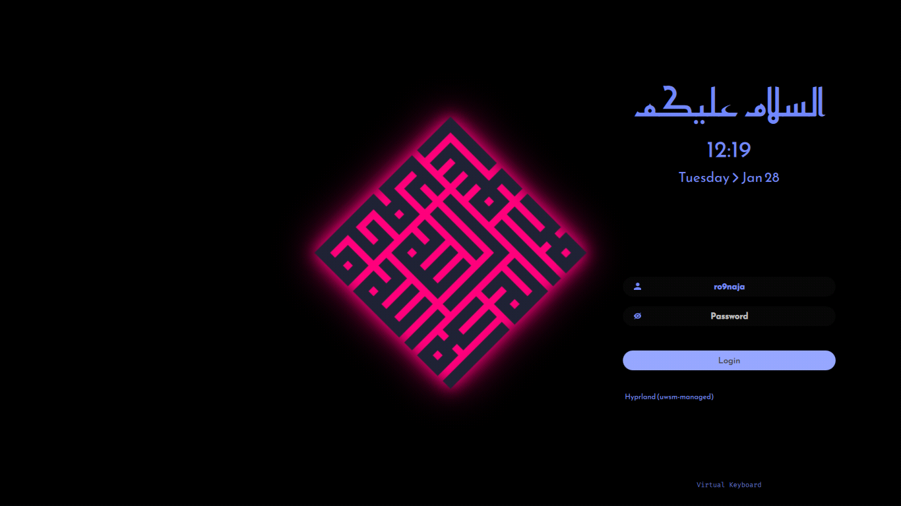
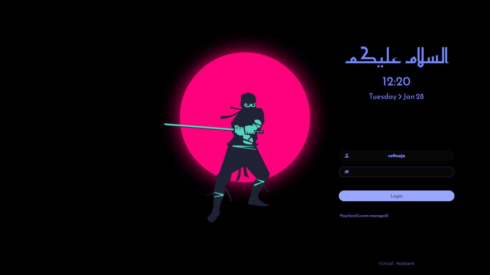
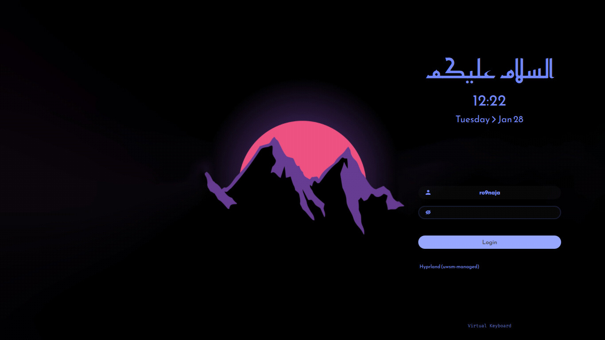
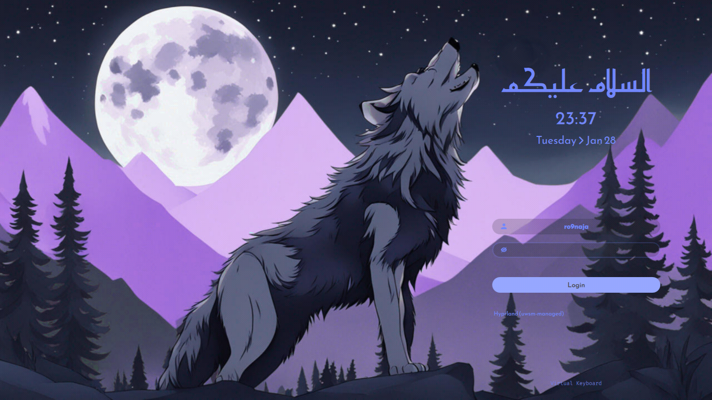

<h2 align="center">🗼 Simple SDDM Theme 2 - QT6 🗼</h2>

<p align=center>
A Simple theme variant for the <a href="https://github.com/sddm/sddm">SDDM Login Manager</a>
</p>

<h2 align=center>Preview (Using sddm-greeter-qt6 --test-mode --themes)</h2>
<center>

<details>
<summary align=center>More Previews</summary>




</details>
</center>

## Install
> _Assumes that you've installed and configured SDDM correctly_ (if not [read more](https://wiki.archlinux.org/title/SDDM))

>  Please make sure you have the following dependencies installed:
- [`For Arch Linux`]
`qt6-5compat` `qt6-declarative` `qt6-svg` `sddm`

- [`For Fedora Linux`]
`qt6-qt5compat` `qt6-qtdeclarative` `qt6-qtsvg` `sddm`

- [`For OpenSuse TW`]
`qt6-qt5compat` `qt6-declarative` `qt6-svg` `sddm-qt6`

## Configure

Edit the or create if it does not exist `/etc/sddm.conf.d/theme.conf.user` (with any text editor with **raised** privileges), so that it looks like this:

```bash
sudo nano /etc/sddm.conf.d/theme.conf.user # use any text editor with raised privileges
---

[Theme]
Current=simple-sddm-2
   ```

### Language and time format
- By default, it is configured with 24H format. You can change to AM/PM variant by editing the theme.conf
```bash
sudo nano /usr/share/sddm/themes/simple-sddm-2/theme.conf  # use any text editor with raised privileges
```
- `HourFormat="hh:mm AP` . Make sure to disable the above of this part

### 🖼️ Default SDDM background
- To change the default background, put desired image in the `/usr/share/sddm/themes/simple-sddm-2/Backgrounds/` folder and add the name of the image followed by its extension (`.jpg` or `.png`) in `theme.conf` file.

- You can also customize it further if you wish in the `/usr/share/sddm/themes/simple-sddm-2/theme.conf`
(blur, form position, etc).

## Credits
- Theme is based on [`LINK`](https://github.com/Keyitdev/sddm-astronaut-theme) by [**Keyitdev**](https://github.com/Keyitdev)


